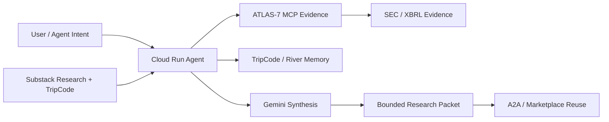
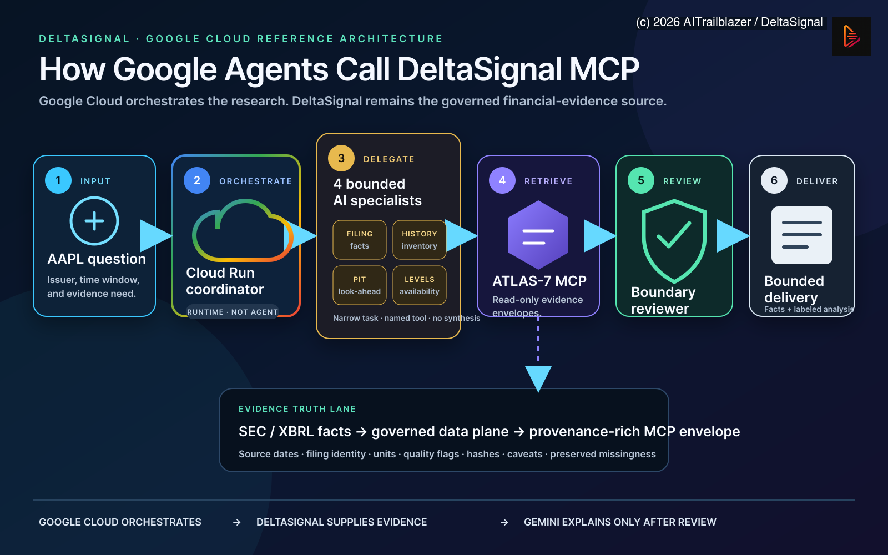
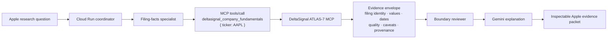

# DeltaSignal · Evidence Infrastructure for Financial Agents

DeltaSignal is an agent-native issuer-intelligence system. It turns a ticker, issuer request, or DeltaSignal TripCode into a reusable research packet with article memory, River continuity, SEC/XBRL evidence boundaries, ATLAS-7 interpretation, agent synthesis, session memory, and usage visibility.

The **Apple/AAPL evidence workflow is the flagship reference**. It is the fastest way to understand the product end to end: filing evidence, ATLAS-7 structural interpretation, bounded MCP delivery, Google Cloud agent review, missing-data handling, and provenance-rich output.

## Public repository boundary

This repository publishes the product experience, evidence contracts, architecture diagrams, public demos, and integration surfaces. The Google Cloud deployment implementation—including Cloud Build configuration, container definitions, provider-specific model adapters, and protected runtime entry points—is maintained in the private operator workspace and is not distributed in the public source tree. No credentials are stored in this repository.

The product serves three connected audiences:

- **Researchers and subscribers** who want differentiated, filing-backed issuer analysis.
- **Agent builders** who need discoverable, bounded financial-evidence tools.
- **Teams and clients** building diligence, compliance, portfolio, and research-copilot workflows.

## Live Links

| Asset | Link |
| --- | --- |
| Google Cloud AAPL client demo | https://aitrailblazer.github.io/deltasignal-ai-agent/client-demo/google-cloud-aapl/Google_Cloud_AAPL_DeltaSignal_MCP_Client_Demo_2026_08_06.html |
| Daily backend → Google agents architecture | https://aitrailblazer.github.io/deltasignal-ai-agent/docs/DeltaSignal_Daily_Backend_to_Google_Agents_Architecture_2026_08_06.html |
| AAPL three-minute video scenario | https://aitrailblazer.github.io/deltasignal-ai-agent/docs/Google_Cloud_AAPL_MCP_Three_Minute_Video_Scenario_2026_08_06.html |
| Public landing page | https://aitrailblazer.github.io/deltasignal-ai-agent/ |
| Product presentation | https://aitrailblazer.github.io/deltasignal-ai-agent/?tour=1 |
| Architecture diagram | https://aitrailblazer.github.io/deltasignal-ai-agent/docs/DeltaSignal_AI_Agent_Architecture_Diagram.html |
| A2A / Marketplace spec | https://aitrailblazer.github.io/deltasignal-ai-agent/docs/DeltaSignal_AI_Agent_Track3_A2A_Marketplace.html |
| Enhanced demo video | https://youtu.be/YegCr4gFDII |
| Guided HUT demo | https://aitrailblazer.github.io/deltasignal-ai-agent/START_HERE.html |
| Cloud Run demo UI | https://deltasignal-ai-agent-mhaufviwaq-uc.a.run.app/demo |
| DeltaSignal ATLAS-7 MCP surface | https://aitrailblazer.github.io/deltasignal-atlas-codex-plugin/ |
| Agent-readable MCP operator contract | https://aitrailblazer.github.io/deltasignal-atlas-codex-plugin/llms-full.txt |
| DeltaSignal research | https://deltasignal.substack.com/ |

Record the deterministic six-slide product presentation at 1920×1080:

```bash
npx playwright install ffmpeg
node scripts/record-product-tour.mjs
```

Set `DELTASIGNAL_SITE_URL` to record a local preview instead of the deployed page.

## What It Does

The HUT proof path starts from a public Delta Signal Substack article:

`TF-SUB-9DA70A7F98`

That TripCode resolves into:

- HUT article memory
- 10-node HUT River continuity
- prior research nodes
- thesis deltas
- weakened assumptions
- monitor-next actions
- evidence boundaries
- A2A-compatible response packets

The agent is designed to return **evidence packages, not unconstrained AI opinions**.

## Architecture


Core loop:



Component roles:

- **Substack Research** starts the loop with a published thesis and TripCode.
- **TripCode / River** preserves research memory and thesis continuity.
- **ATLAS-7** is the evidence engine for SEC/XBRL-grounded issuer intelligence.
- **Gemini** orchestrates synthesis and produces readable diligence output.
- **Cloud Run** hosts the deployed Go service and protected demo routes.
- **A2A Agent Card** exposes skills for external agent discovery and invocation.

## How Google Agents Call DeltaSignal MCP

The Google Cloud layer orchestrates the research; it does not recreate the
financial evidence.



*AAPL reference topology: Google Cloud coordinates the bounded workflow, while
DeltaSignal remains the governed SEC/XBRL evidence source.*

A protected Cloud Run coordinator validates the request,
delegates to a narrow specialist, and calls a named read-only tool on the
[DeltaSignal ATLAS-7 MCP surface](https://aitrailblazer.github.io/deltasignal-atlas-codex-plugin/).
The raw evidence envelope is preserved for review before Gemini writes a
readable brief.



Logical Apple request shape:

```json
{
  "jsonrpc": "2.0",
  "id": "aapl-fundamentals-1",
  "method": "tools/call",
  "params": {
    "name": "deltasignal_company_fundamentals",
    "arguments": {
      "ticker": "AAPL"
    }
  }
}
```

The specialist preserves issuer identity, filing form and period, accession,
reported values, units, source dates, quality flags, hashes, caveats, route
provenance, and access status when returned. If Apple does not disclose a
requested item—such as direct Apple Intelligence revenue attribution—the
result remains unresolved rather than being inferred by Gemini.

The public AAPL page is a deterministic contract demonstration. Live MCP calls
occur only in the protected server runtime. Credentials never enter the
browser, and an HTTP 402 changes access only; it never changes the evidence.

## Agent-Native Proof

The submitted system exposes:

- `/.well-known/agent-card.json`
- `/a2a`
- `/resolve`
- `/v1/tripcode`
- `/v1/scenarios/run`
- `/v1/usage`

The Agent Card advertises three skills:

- `resolve-tripcode-research-packet`
- `monitor-tripcode-thesis`
- `run-track3-scenario`

This makes DeltaSignal a specialist issuer-intelligence agent that portfolio, compliance, data-room, subscriber, or research copilots can call as part of a larger enterprise workflow.

## Demo Flow

Watch the official submission demo:

[](https://youtu.be/_D3q5qKF5k4?si=N4VI1WvA1rRdBWvh)

Watch the enhanced demo version:

[](https://youtu.be/YegCr4gFDII)

The short demonstration shows:

1. Start from the HUT Substack article and visible TripCode.
2. Discover the deployed agent surface.
3. Run a protected HUT TripCode resolve call.
4. Show raw JSON proof.
5. Render the same response as a readable evidence page.
6. Monitor the thesis after publication.
7. Show usage visibility and boundaries.

Run locally:

```bash
GOWORK=off go test ./...
PORT=8080 DELTASIGNAL_DEMO_API_KEY=local-demo-key DELTASIGNAL_ENABLE_TRIPCODE_FALLBACK=true GOWORK=off go run ./cmd/server
open http://127.0.0.1:8080/demo
```

## Protected Demo Access

The hosted demo uses a private demo key for protected routes. The key is sent only as:

```text
X-Demo-Key: <private demo key>
```

This keeps the public health, landing, and Agent Card surfaces open while protecting paid or credit-consuming execution paths.

## Verification

Current local verification gate:

```bash
GOWORK=off go test ./...
```

The project keeps request/response evidence under:

```text
artifacts/04_TRACK_3_PATH__A2A_MARKETPLACE_RUNTIME/
```

## Boundary

DeltaSignal outputs are evidence-routing alerts and diligence triage only. They are not investment advice, recommendations, price targets, or order instructions.
