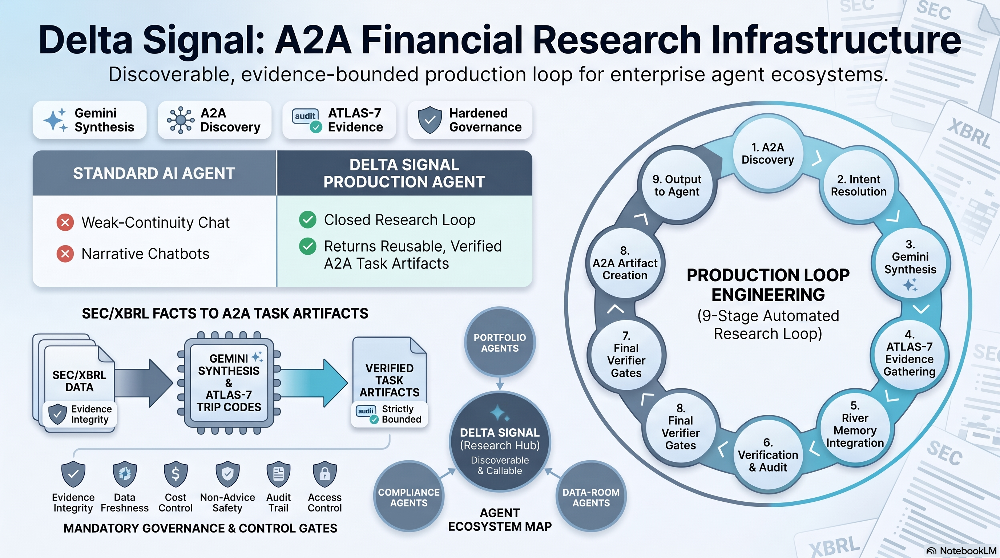
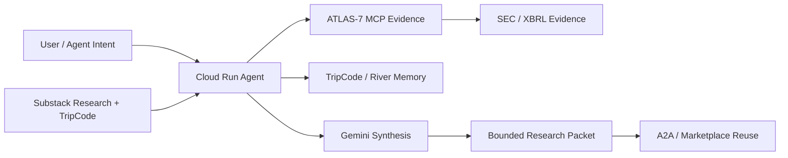

# DeltaSignal Gemini AI Agent

**Google for Startups AI Agents Challenge 2026 · Track 3**

DeltaSignal Gemini AI Agent is an agent-native issuer-intelligence system for crypto-exposed public companies. It turns a ticker, issuer request, or DeltaSignal TripCode into a reusable research packet with article memory, River continuity, SEC/XBRL evidence boundaries, Gemini synthesis, session memory, and usage visibility.

The entry is submitted for **Track 3** because the product is not only a working demo. It is a callable agent surface that other enterprise agents can discover, invoke, verify, remember, and reuse.

## Live Links

| Asset | Link |
| --- | --- |
| Google Cloud AAPL client demo | https://aitrailblazer.github.io/deltasignal-ai-agent/client-demo/google-cloud-aapl/Google_Cloud_AAPL_DeltaSignal_MCP_Client_Demo_2026_08_06.html |
| Daily backend → Google agents architecture | https://aitrailblazer.github.io/deltasignal-ai-agent/docs/DeltaSignal_Daily_Backend_to_Google_Agents_Architecture_2026_08_06.html |
| AAPL three-minute video scenario | https://aitrailblazer.github.io/deltasignal-ai-agent/docs/Google_Cloud_AAPL_MCP_Three_Minute_Video_Scenario_2026_08_06.html |
| Public landing page | https://aitrailblazer.github.io/deltasignal-ai-agent/ |
| Official submission packet | https://aitrailblazer.github.io/deltasignal-ai-agent/docs/DeltaSignal_AI_Agent_Submission_Packet_2026_06_04.html |
| Architecture diagram | https://aitrailblazer.github.io/deltasignal-ai-agent/docs/DeltaSignal_AI_Agent_Architecture_Diagram.html |
| Track 3 A2A / Marketplace spec | https://aitrailblazer.github.io/deltasignal-ai-agent/docs/DeltaSignal_AI_Agent_Track3_A2A_Marketplace.html |
| Official submission demo video | https://youtu.be/_D3q5qKF5k4?si=N4VI1WvA1rRdBWvh |
| Enhanced demo video | https://youtu.be/YegCr4gFDII |
| Guided HUT demo | https://aitrailblazer.github.io/deltasignal-ai-agent/START_HERE.html |
| Cloud Run demo UI | https://deltasignal-ai-agent-mhaufviwaq-uc.a.run.app/demo |
| ATLAS-7 evidence surface | https://aitrailblazer.github.io/deltasignal-atlas-codex-plugin/index.html |

## What It Does

The HUT proof path starts from a public Delta Signal Substack article:

`TF-SUB-9DA70A7F98`

That TripCode resolves into:

- HUT article memory
- 10-node HUT River continuity
- prior research nodes
- thesis deltas
- weakened assumptions
- monitor-next actions
- evidence boundaries
- A2A-compatible response packets

The agent is designed to return **evidence packages, not unconstrained AI opinions**.

## Architecture



Core loop:



Component roles:

- **Substack Research** starts the loop with a published thesis and TripCode.
- **TripCode / River** preserves research memory and thesis continuity.
- **ATLAS-7** is the evidence engine for SEC/XBRL-grounded issuer intelligence.
- **Gemini** orchestrates synthesis and produces readable diligence output.
- **Cloud Run** hosts the deployed Go service and protected demo routes.
- **A2A Agent Card** exposes skills for external agent discovery and invocation.

## Track 3 Proof

The submitted system exposes:

- `/.well-known/agent-card.json`
- `/a2a`
- `/resolve`
- `/v1/tripcode`
- `/v1/scenarios/run`
- `/v1/usage`

The Agent Card advertises three skills:

- `resolve-tripcode-research-packet`
- `monitor-tripcode-thesis`
- `run-track3-scenario`

This makes DeltaSignal a specialist issuer-intelligence agent that portfolio, compliance, data-room, subscriber, or research copilots can call as part of a larger enterprise workflow.

## Demo Flow

Watch the official submission demo:

[](https://youtu.be/_D3q5qKF5k4?si=N4VI1WvA1rRdBWvh)

Watch the enhanced demo version:

[](https://youtu.be/YegCr4gFDII)

The short demonstration shows:

1. Start from the HUT Substack article and visible TripCode.
2. Discover the deployed agent surface.
3. Run a protected HUT TripCode resolve call.
4. Show raw JSON proof.
5. Render the same response as a readable evidence page.
6. Monitor the thesis after publication.
7. Show usage visibility and boundaries.

Run locally:

```bash
GOWORK=off go test ./...
PORT=8080 DELTASIGNAL_DEMO_API_KEY=local-demo-key DELTASIGNAL_ENABLE_TRIPCODE_FALLBACK=true GOWORK=off go run ./cmd/server
open http://127.0.0.1:8080/demo
```

## Protected Demo Access

The hosted demo uses a private demo key for protected routes. The key is sent only as:

```text
X-Demo-Key: <private demo key>
```

This keeps the public health, landing, and Agent Card surfaces open while protecting paid or credit-consuming execution paths.

## Verification

Current local verification gate:

```bash
GOWORK=off go test ./...
```

The project keeps request/response evidence under:

```text
artifacts/04_TRACK_3_PATH__A2A_MARKETPLACE_RUNTIME/
```

## Boundary

DeltaSignal outputs are evidence-routing alerts and diligence triage only. They are not investment advice, recommendations, price targets, or order instructions.
